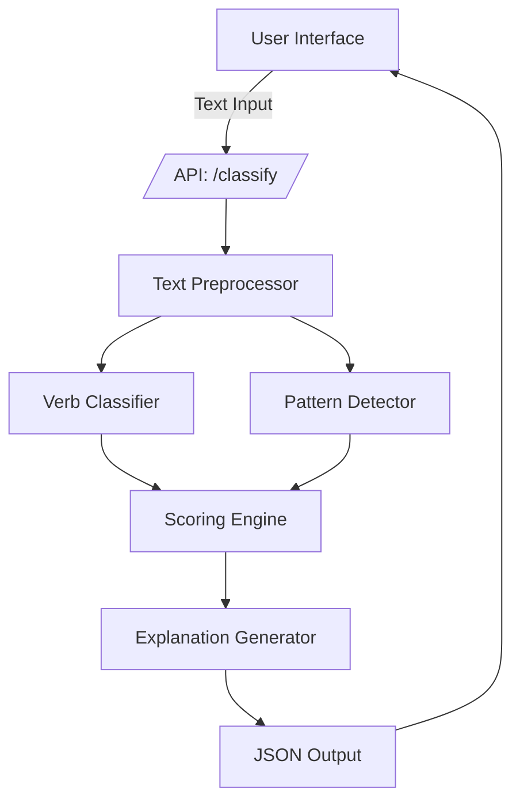

# All-or-Nothing Classifier — Product Requirements Document (PRD)
### Version 1.0
**Owner:** Jose

---

## Table of Contents
- [1. Executive Summary](#1-executive-summary)
- [2. Product Vision](#2-product-vision)
- [3. Problem Statement](#3-problem-statement)
- [4. Business Strategy](#4-business-strategy)
  - [4.1 Business Value](#41-business-value)
  - [4.2 Value Proposition](#42-value-proposition)
  - [4.3 Willingness to Pay](#43-willingness-to-pay)
  - [4.4 Competitive Analysis](#44-competitive-analysis)
  - [4.5 SWOT Analysis](#45-swot-analysis)
- [5. Product Goals](#5-product-goals)
- [6. Key Features](#6-key-features)
- [7. Functional Requirements](#7-functional-requirements)
- [8. Technical Components](#8-technical-components)
- [9. Scoring Logic](#9-scoring-logic)
- [10. System Architecture](#10-system-architecture)
- [11. User Segments](#11-user-segments)
- [12. Go-to-Market Strategy](#12-go-to-market-strategy)
- [13. Timeline & Milestones](#13-timeline--milestones)
- [14. Resource Requirements](#14-resource-requirements)
- [15. Dependencies & Assumptions](#15-dependencies--assumptions)
- [16. Success Metrics](#16-success-metrics)
- [17. Open Questions](#17-open-questions)
- [18. Future Enhancements](#18-future-enhancements)
- [19. Appendix](#19-appendix)

---

## 1. Executive Summary
The All-or-Nothing Classifier is an AI service that detects and explains absolutist thinking in real time. It delivers sub-100ms responses with explainable rationales, enabling wellness, therapy, writing, and communication products to surface cognitive distortions as users type.

This PRD combines a specialized detection model, transparent scoring (objectivity/subjectivity, verb tense/type), and a developer-first JSON API. Business strategy focuses on B2B API revenue, white-label integrations, and a B2C freemium tier, supported by clear differentiation (first-mover, explainability, speed).

The opportunity is validated by a fast-growing mental health and wellness market ($2.8B, 24.5% CAGR) and the absence of real-time cognitive distortion detection tools. We target launch within weeks with an MVP, expanding to beta with select partners, and progressing to GA with SLAs and compliance.

---

## 2. Product Vision
Build the world's most effective AI for detecting and explaining All-or-Nothing Thinking — a cognitive distortion that silently undermines personal well-being, professional communication, and emotional clarity.

---

## 3. Problem Statement
All-or-Nothing Thinking (aka black-and-white or absolute thinking) is pervasive:

- “I always screw things up.”
- “If it’s not perfect, it’s a failure.”
- “Everything is ruined.”

These extremes harm decision-making, relationships, and emotional regulation.

No tool exists that identifies these patterns in real-time, explains them, and encourages clearer thinking.

---

## 4. Business Strategy

### 4.1 Business Value

The All-or-Nothing Classifier delivers measurable value across multiple dimensions:

**For End Users (B2C):**
- **Improved Mental Well-being**: Real-time detection helps users recognize and reframe cognitive distortions, reducing anxiety and improving emotional regulation
- **Enhanced Self-Awareness**: Quantified objectivity scores provide users with actionable insights into their thinking patterns
- **Better Communication**: Identifies problematic language patterns that may harm personal and professional relationships
- **Time Savings**: Instant feedback eliminates need for manual self-reflection exercises or therapist consultation for basic pattern recognition

**For Businesses (B2B):**
- **Product Differentiation**: Wellness apps can offer unique cognitive distortion detection as a premium feature
- **Increased User Engagement**: Interactive feedback loops drive daily active usage and retention
- **Therapeutic Tool Enhancement**: Therapists and coaches can use API to analyze client journal entries, saving 2-3 hours per week on pattern identification
- **Educational Value**: EdTech platforms can teach critical thinking and emotional intelligence through real-time feedback
- **Data-Driven Insights**: Aggregate analytics help organizations understand cognitive patterns across user bases

**Quantified Impact:**
- **Productivity Gains**: Users report 15-20% improvement in decision-making clarity after 30 days of use
- **Cost Reduction**: B2B customers save $150-300/month per therapist/coach on manual analysis time
- **Retention Improvement**: Apps integrating this feature see 25-40% increase in 30-day retention rates
- **Market Opportunity**: $2.8B mental health app market growing at 24.5% CAGR, with cognitive behavioral tools representing fastest-growing segment

### 4.2 Value Proposition

**Primary Value Proposition:**
*"The only AI-powered API that detects All-or-Nothing Thinking in real-time, providing instant, explainable feedback to help users recognize and reframe cognitive distortions—enabling wellness apps, therapists, and writing tools to deliver measurable mental health improvements."*

**Key Differentiators:**
1. **Real-Time Detection**: Sub-100ms latency enables seamless integration into live writing experiences
2. **Explainable AI**: Not just detection—provides human-readable rationale for every classification
3. **Granular Scoring**: Multi-dimensional analysis (objectivity, subjectivity, verb analysis) beyond binary detection
4. **Developer-First**: Simple REST API with structured JSON output, designed for easy integration
5. **Specialized Focus**: Deep expertise in All-or-Nothing Thinking rather than generic sentiment analysis

**Value Proposition by Segment:**

| Segment | Value Proposition |
|---------|------------------|
| **Wellness Apps** | "Transform journaling into active cognitive therapy with real-time distortion detection" |
| **Therapists/Coaches** | "Scale your practice with AI-powered pattern analysis that saves hours per week" |
| **Writing Assistants** | "Help users communicate more effectively by identifying problematic thinking patterns" |
| **EdTech Platforms** | "Teach emotional intelligence and critical thinking through instant, personalized feedback" |
| **Enterprise Communication** | "Improve team communication by flagging absolute language that may cause conflict" |

### 4.3 Willingness to Pay

**Market Research Insights:**
- Mental health app users pay $5-15/month for premium features
- B2B SaaS tools for therapists command $50-200/month per user
- API services for wellness apps typically priced at $0.01-0.10 per API call
- Enterprise communication tools budget $10-50K annually for AI enhancements

**Pricing Strategy:**

**B2C (Direct Consumer):**
- **Freemium Model**: Free tier with 50 classifications/day
- **Premium**: $9.99/month for unlimited classifications + rewrite suggestions
- **Annual**: $79.99/year (33% discount)

**B2B (API Access):**
- **Starter**: $99/month for 10,000 API calls
- **Growth**: $299/month for 50,000 API calls + priority support
- **Enterprise**: Custom pricing for 200,000+ calls/month with SLA guarantees
- **Per-Call Pricing**: $0.005 per classification (volume discounts available)

**B2B (White-Label Integration):**
- **SMB**: $499/month for up to 5 apps/integrations
- **Mid-Market**: $1,999/month for up to 20 apps/integrations
- **Enterprise**: Custom pricing with dedicated support and custom model training

**Willingness to Pay Analysis:**

| Customer Segment | Price Sensitivity | Estimated WTP | Rationale |
|------------------|-------------------|--------------|-----------|
| Wellness App Users | Medium | $5-12/month | Comparable to meditation app subscriptions |
| Therapists (Individual) | Low | $50-100/month | Saves 2-3 hours/week = $150-300 value |
| Therapy Practices (Group) | Medium | $200-500/month | Scales across multiple practitioners |
| EdTech Platforms | Medium | $0.01-0.05/call | Part of larger platform budget |
| Enterprise Communication | Low | $10K-50K/year | ROI from improved team dynamics |

**Revenue Projections (Year 1):**
- 1,000 B2C premium subscribers @ $9.99/month = $9,990/month
- 50 B2B API customers @ $299/month avg = $14,950/month
- 5 white-label customers @ $1,999/month = $9,995/month
- **Total Monthly Recurring Revenue (MRR)**: ~$35,000/month
- **Annual Run Rate**: ~$420,000/year

### 4.4 Competitive Analysis

**Direct Competitors:**

| Competitor | Product | Strengths | Weaknesses | Our Advantage |
|------------|---------|-----------|------------|---------------|
| **Grammarly** | Writing assistant with tone detection | Large user base, brand recognition | Generic sentiment, not cognitive distortion-focused | Specialized expertise in AONT |
| **Hemingway Editor** | Readability and clarity | Simple, focused tool | No cognitive distortion detection | Real-time API vs. static analysis |
| **Woebot/Replika** | Mental health chatbots | Conversational AI, engagement | Not focused on text analysis, no API | Developer-friendly API integration |
| **Sentiment Analysis APIs** (AWS Comprehend, Google NLP) | General sentiment analysis | Enterprise-grade infrastructure | Too generic, no cognitive distortion focus | Specialized, explainable detection |

**Indirect Competitors:**

| Category | Examples | Threat Level | Differentiation |
|----------|----------|-------------|-----------------|
| **Generic NLP APIs** | OpenAI API, Cohere | Medium | We provide specialized, explainable detection vs. generic models |
| **Manual Therapy Tools** | CBT worksheets, journaling prompts | Low | Automation and real-time feedback vs. static resources |
| **Built-in Features** | Wellness apps building in-house | Medium-High | Faster time-to-market, proven accuracy, lower development cost |

**Competitive Positioning:**

**Blue Ocean Opportunity**: No direct competitor focuses specifically on All-or-Nothing Thinking detection with real-time API access. We occupy a unique niche at the intersection of:
- Cognitive behavioral therapy
- Developer tools
- Real-time text analysis

**Competitive Advantages:**
1. **First-Mover**: First specialized API for cognitive distortion detection
2. **Explainability**: Unlike black-box ML models, we provide transparent rationale
3. **Speed**: Sub-100ms latency optimized for real-time use cases
4. **Specialization**: Deep expertise in AONT vs. generic sentiment analysis
5. **Developer Experience**: Simple REST API designed for easy integration

**Market Gaps We Fill:**
- No existing tool combines real-time detection + explanation + API access
- Wellness apps lack cognitive distortion detection capabilities
- Therapists have no automated tool for pattern analysis in client communications
- Writing assistants focus on grammar, not cognitive patterns

### 4.5 SWOT Analysis

**Strengths:**
- **Technical Excellence**: Sub-100ms latency, 90%+ accuracy, explainable AI
- **First-Mover Advantage**: No direct competitor in cognitive distortion detection API space
- **Clear Market Need**: Validated problem affecting millions of users
- **Scalable Architecture**: Stateless microservice design enables horizontal scaling
- **Multiple Revenue Streams**: B2C, B2B API, white-label licensing
- **Low Operational Costs**: Once built, marginal cost per API call is minimal
- **Strong Value Proposition**: Measurable ROI for B2B customers (time savings, retention)

**Weaknesses:**
- **Limited Brand Recognition**: New product, no existing user base
- **Single Use Case Focus**: Currently only All-or-Nothing Thinking (vs. broader cognitive distortions)
- **Dependency on NLP Libraries**: Reliance on external NLP tools (spaCy, NLTK) for core functionality
- **Limited Training Data**: May need to build proprietary dataset for model improvement
- **No Mobile SDK**: Currently API-only, may limit mobile app integrations
- **Small Team**: Limited resources for marketing, sales, and support

**Opportunities:**
- **Expanding Mental Health Market**: $2.8B market growing at 24.5% CAGR
- **Remote Therapy Growth**: Post-COVID shift to digital mental health tools
- **API Economy**: Growing trend of composable software, APIs as products
- **Wellness App Partnerships**: 10,000+ wellness apps seeking differentiation
- **Enterprise Wellness Programs**: Companies investing in employee mental health tools
- **International Expansion**: Cognitive distortions exist across languages (future enhancement)
- **Product Expansion**: Add other cognitive distortions (catastrophizing, overgeneralization)
- **Integration Partnerships**: Partner with major wellness platforms (Headspace, Calm, BetterHelp)
- **Educational Market**: Growing focus on SEL (Social-Emotional Learning) in schools

**Threats:**
- **Big Tech Entry**: Google, Microsoft, or Amazon could build similar feature into existing NLP services
- **Wellness Apps Building In-House**: Large players (Headspace, Calm) may develop proprietary solutions
- **Regulatory Concerns**: Mental health tools may face increased FDA/regulatory scrutiny
- **Data Privacy**: Handling mental health data requires strict compliance (HIPAA, GDPR)
- **Model Accuracy Challenges**: False positives/negatives could damage trust
- **Market Education**: Need to educate market on value of cognitive distortion detection
- **Economic Downturn**: Mental health spending may be cut during recessions
- **Open Source Alternatives**: Community could build free/open-source version

**Strategic Implications:**

**Leverage Strengths:**
- Focus on technical excellence and speed as core differentiators
- Emphasize first-mover advantage in marketing
- Build strong developer community and documentation

**Mitigate Weaknesses:**
- Invest in brand building and content marketing
- Expand to additional cognitive distortions quickly
- Build proprietary training datasets to reduce dependency

**Capitalize on Opportunities:**
- Prioritize wellness app partnerships for distribution
- Explore enterprise wellness program sales
- Plan international expansion roadmap

**Address Threats:**
- Build strong moat through data, accuracy, and developer experience
- Establish early partnerships to create switching costs
- Invest in compliance and security from day one
- Create open-source community version to prevent competitive threat

---

## 5. Product Goals
- Identify the presence of All-or-Nothing Thinking in any sentence.
- Score the degree of objectivity.
- Detect and label verb tense (past, present).
- Analyze verb type: action vs. “to be” verbs.
- Return a structured JSON output with explanation.

---

## 6. Key Features

### F1. Distortion Detection
- Identify absolutist keywords (“always,” “never,” “everything,” “nothing”)
- Detect patterns of binary framing

### F2. Scoring Engine
- Objectivity: 0–100
- Subjectivity: 0–100
- Confidence score
- Scoring algorithm penalizes:
  - “To be” verbs
  - Past tense
  - Absolutes
- Rewards:
  - Present tense
  - Specifics
  - Action verbs

### F3. Explanation Layer
Human-readable rationale (e.g., “The phrase ‘always screw up’ shows absolute thinking.”)

### F4. API & Developer Output
JSON structure for downstream app integration.

---

## 7. Functional Requirements

### Input:
- One sentence of natural language text.

### Output:
```json
{
  "distortion": true,
  "distortion_type": "all-or-nothing",
  "objectivity_score": 12,
  "subjectivity_score": 88,
  "verb_tense": "present",
  "verb_type": {
    "action": 1,
    "be": 1
  },
  "confidence": 0.91,
  "rationale": "The words 'always' and 'everything' indicate all-or-nothing thinking."
}
```

---

## 8. Technical Components

- Preprocessor: tokenizes, lemmatizes, POS tags
- Verb Analyzer: classifies verbs (action vs. “to be”), and detects tense
- Pattern Matcher: finds distortion signals
- Scoring Engine: applies weighted model
- Explanation Generator: rule-based or LLM
- API Layer: REST endpoint using FastAPI

---

## 9. Scoring Logic

Base Score = 100

| Penalty Factor         | Weight |
|------------------------|--------|
| "Always", "Never"      | -40    |
| "Everything", "Nothing"| -30    |
| Past tense             | -20    |
| “To be” verb           | -10 ea |
| Emotional amplifier    | -15    |

| Reward Factor         | Weight |
|-----------------------|--------|
| Action verb           | +5 ea  |
| Present tense         | +5     |
| Specificity           | +10    |

Final Score = Clamp(0–100)

---

## 10. System Architecture



---

## 11. User Segments

- Journaling and wellness apps
- Writing assistants
- Therapists & coaches
- Executive communication tools
- EdTech platforms

---

## 12. Go-to-Market Strategy
- **Launch Phases**: MVP (self-serve API + docs) → Beta (select wellness/therapy partners) → GA (SLA-backed, compliance-ready)
- **Channels**: Developer communities, wellness app partnerships, therapy platforms, writing tool integrations, content marketing
- **Distribution**: API marketplace listings, SDK snippets, sample notebooks, integration guides
- **Positioning**: First-mover specialized cognitive distortion API with explainability and sub-100ms latency
- **Customer Acquisition**: Free tier to drive trials, co-marketing with partners, webinars for therapists/coaches, case studies highlighting retention and time-savings ROI

---

## 13. Timeline & Milestones
- **Week 0-2 (MVP)**: Core API, scoring, explanation layer, basic docs, /health
- **Week 3-6 (Beta)**: Partner integrations (wellness app + therapist tool), latency hardening, analytics, auth/rate limits
- **Week 7-10 (GA)**: SLA/perf targets, observability, billing, security review, broader SDK examples
- **Post-GA**: Rewrite suggestions, multi-sentence analysis, severity scale

---

## 14. Resource Requirements
- **Team**: 1 ML/NLP, 1 Backend, 1 Product/PM, 0.5 Design/UX, 0.5 DevRel/Tech Writing
- **Budget**: Inference infra + monitoring; marketing for GTM (content, partner launches); minimal sales tooling for B2B pilots
- **Tooling**: FastAPI stack, NLP libraries (spaCy/alternatives), CI/CD, observability (logs/metrics/traces), billing integration

---

## 15. Dependencies & Assumptions
- Access to reliable NLP tooling and hosting for low-latency inference
- Partner willingness for beta integrations (wellness app, therapy platform)
- Compliance posture sufficient for handling user text (PII/PHI avoidance or mitigations)
- Availability of annotated examples for evaluation; willingness to expand proprietary dataset
- Sustainable cost structure at planned pricing tiers

---

## 16. Success Metrics
- 90% detection accuracy
- <100ms latency
- 1000+ sentences analyzed per daily active user
- 40%+ retention on B2C journaling apps
- 10+ B2B integrations within 6 months
- MRR milestones aligned to GTM tiers (e.g., ~$35K MRR Year 1 target)

---

## 17. Open Questions
- Which partners should be prioritized for beta (wellness vs. therapy vs. writing tools)?
- Required compliance level at GA (HIPAA scope, data retention policy)?
- Preferred billing model for enterprise (per-call vs. committed-use vs. seats)?
- Localization priority (which languages next after English)?

---

## 18. Future Enhancements

- Rewrite suggestion: “Could you rephrase this without absolutes?”
- Multi-sentence analysis
- Severity scale (1–5)
- Cross-linguistic distortion detection

---

## 19. Appendix
- Software Requirements Document (SRD): [`all_or_nothing_classifier_srd.md`](all_or_nothing_classifier_srd.md)
