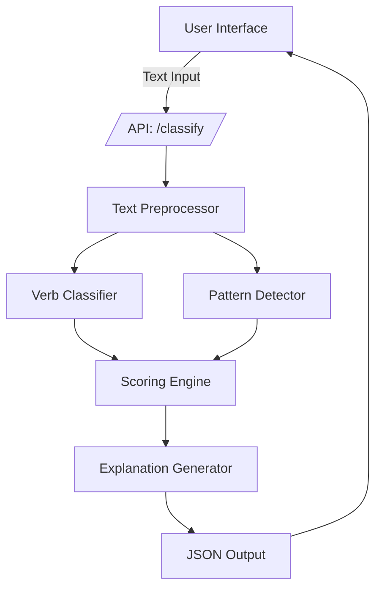

# All-or-Nothing Classifier — Software Requirements Document (SRD)
Version: 1.0  
Owner: Jose

## 1. Purpose
This document defines the software-level requirements for the All-or-Nothing Classifier, an AI microservice that detects and scores All-or-Nothing Thinking in text, aligned to the latest PRD.

## 2. Scope
The service receives a short text input and returns:
- Distortion detection
- Verb tense analysis
- Verb type analysis
- Objectivity/subjectivity scores
- Explanation and confidence
- Structured JSON output for downstream app integration (F1–F4 alignment)

## 3. Product Goals
- Identify the presence of All-or-Nothing Thinking in any sentence.
- Score the degree of objectivity.
- Detect and label verb tense (past, present).
- Analyze verb type: action vs. “to be” verbs.
- Return a structured JSON output with explanation.

## 4. Definitions
- All-or-Nothing Thinking (AONT)
- Action Verb
- Be-Verb
- NLP
- API

## 5. System Overview
Stateless microservice with:
- Preprocessor: tokenizes, lemmatizes, POS tags
- Verb analyzer: classifies verbs (action vs. “to be”), detects tense
- Pattern matcher: finds distortion signals
- Scoring engine: applies weighted model
- Explanation generator: rule-based or LLM
- API layer: REST endpoint using FastAPI

## 6. Functional Requirements
### Input
POST /classify with:
```json
{"text": "string"}
```

### Output
Structured JSON with detection results, scores, verb analysis, rationale, and confidence (see API Specification).

### Key Features (PRD F1–F4 alignment)
- F1 Distortion Detection: absolutist keywords (“always,” “never,” “everything,” “nothing”), binary framing.
- F2 Scoring Engine: objectivity 0–100, subjectivity 0–100, confidence score with weighted penalties/rewards.
- F3 Explanation Layer: human-readable rationale for every classification.
- F4 API & Developer Output: JSON suited for downstream integration.

### Preprocessing
- Tokenization
- POS tagging
- Lemmatization

### Feature Extraction
- Absolutist keywords
- Binary framing
- Emotional amplifiers

### Verb Analysis
- Present vs past
- Action vs be-verbs

### Scoring
- Base 100, weighted penalties and rewards applied (see Scoring Logic).

## 7. Non-Functional Requirements
- Latency < 100ms
- Scalable
- 99.9% uptime
- No plaintext logs

## 8. API Specification
POST /classify  
Request:
```json
{"text": "I always mess everything up."}
```

Response:
```json
{
  "distortion": true,
  "distortion_type": "all-or-nothing",
  "objectivity_score": 12,
  "subjectivity_score": 88,
  "verb_tense": "present",
  "verb_type": {
    "action": 1,
    "be": 0
  },
  "confidence": 0.93,
  "rationale": "The words 'always' and 'everything' indicate all-or-nothing thinking."
}
```

## 9. Technical Components
- Preprocessor: tokenizes, lemmatizes, POS tags.
- Verb Analyzer: classifies verbs (action vs. “to be”), detects tense.
- Pattern Matcher: finds distortion signals.
- Scoring Engine: applies weighted model.
- Explanation Generator: rule-based or LLM.
- API Layer: REST endpoint using FastAPI.

## 10. Scoring Logic
Base Score = 100

| Penalty Factor          | Weight |
|-------------------------|--------|
| "Always", "Never"       | -40    |
| "Everything", "Nothing" | -30    |
| Past tense              | -20    |
| “To be” verb            | -10 ea |
| Emotional amplifier     | -15    |

| Reward Factor   | Weight |
|-----------------|--------|
| Action verb     | +5 ea  |
| Present tense   | +5     |
| Specificity     | +10    |

Final Score = Clamp(0–100)

## 11. System Architecture


## 12. Success Metrics
- 90% detection accuracy
- <100ms latency
- 1000+ sentences analyzed per daily active user
- 40%+ retention on B2C journaling apps
- 10+ B2B integrations within 6 months
- MRR milestones aligned to GTM tiers

## 13. Future Enhancements
- Rewrite suggestion: “Could you rephrase this without absolutes?”
- Multi-sentence analysis
- Severity scale (1–5)
- Cross-linguistic distortion detection

## 14. Technical Dependencies & Assumptions
- Access to reliable NLP tooling and hosting for low-latency inference.
- NLP libraries (spaCy/alternatives) available.
- Compliance posture suitable for handling user text (PII/PHI avoidance or mitigations).
- Availability of annotated examples for evaluation.
- Sustainable cost structure at planned pricing tiers.

## 15. Testing
- Unit tests
- Integration tests
- Benchmarking
- Human evaluation

## 16. Deployment
- Dockerized
- Configurable environments
- /health endpoint
- FastAPI stack for REST API
- NLP libraries (spaCy/alternatives)
- CI/CD pipeline
- Observability (logs/metrics/traces)
- Billing integration for API tiers
